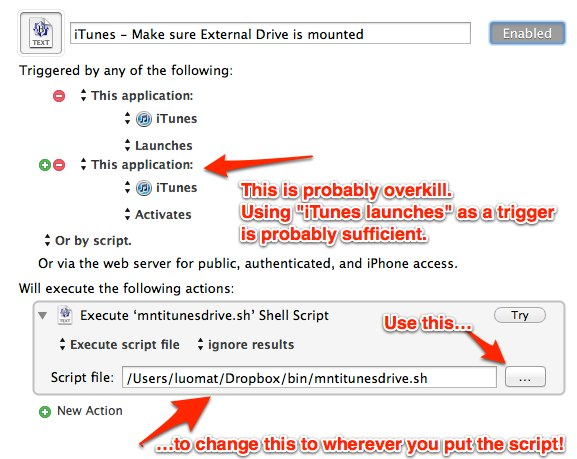

mnt-itunes-drive
================

## What Is It?

A shell script and [Keyboard Maestro] macro to make sure that your external drive used with iTunes is actually mounted.

### Why?

Do you use an external drive with iTunes?

No? Stop reading.

Yes? Do you ever launch iTunes when the drive isn't mounted, only to realize later that iTunes has hëlpfully started storing things on your main drive?

No? Stop reading.

Yes? Well, then this is for you.

### Files Included

[mnt-itunes-drive.kmmacros] — Keyboard Maestro macro which launches script whenever iTunes launches or activates

[mnt-itunes-drive.sh] - the shell script which does the heavy lifting

## Things You __Must__ Do Before This Will Work For You

1. 	edit the `DRIVE_NAME=` variable in [mnt-itunes-drive.sh] to point to the correct name of your external drive

1.	Put [mnt-itunes-drive.sh] somewhere in your $PATH

1.	Load [mnt-itunes-drive.kmmacros] into Keyboard Maestro and point it at wherever you put [mnt-itunes-drive.sh]

